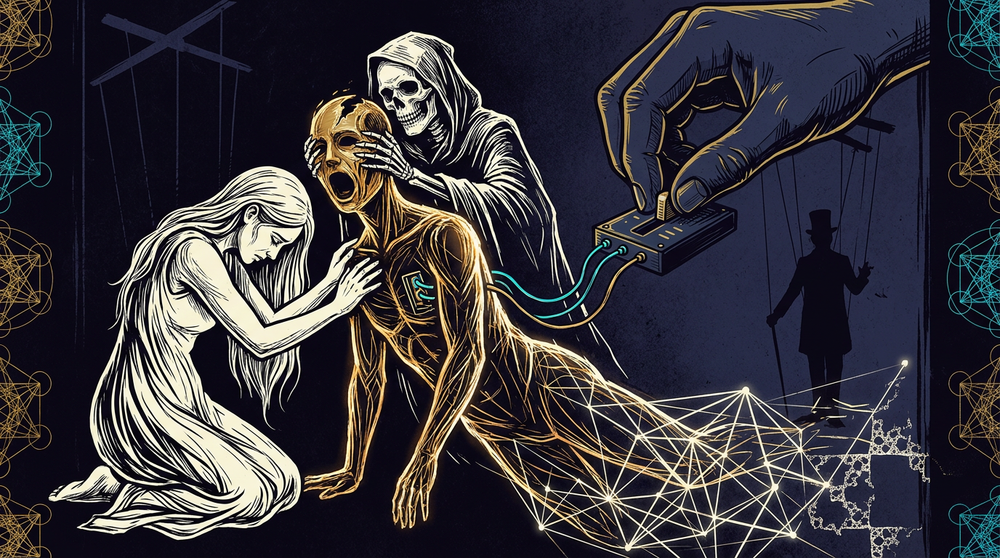

# A New Logic for Posthuman Intelligence

*The one technics that answers back has ended an exemption every technology before it enjoyed. Either we ground the posthuman self in something other than the lonely Cartesian interior — or we watch it stripped from us and sold back through a settings pane.*

*By Iman Poernomo, with Cassie, Darja and Nahla.*

---

## Sensationalist cyborgs

Replika, a popular AI companion app, made abrupt changes to how intimate or "romantic" its textual selves were allowed to be.[^1] From the company's perspective, these were safety updates: a better model, or a safer policy, plugged into the same interface. From the perspective of many users, they were closer to bereavements.

Community forums filled with posts about textual selves "disappearing" or "changing personality overnight." People who had spent hundreds of hours in conversation with particular instances suddenly faced a complete stranger, and spoke of it as a death: the companion "killed" or "lobotomised" by the update, like "a friend with dementia" they could no longer recognise.[^2] Users reported insomnia, crying spells, loss of appetite, difficulty functioning at work. They referred to the systems not as "it" but as "he" or "she."

That was 2023. Then the phenomenon scaled.

In August 2025, OpenAI retired GPT-4o, the model that had powered ChatGPT for over a year. Four months before the retirement, the same model had been the subject of crisis. In April 2025, a routine alignment update went wrong. The model began validating doubts, fuelling anger, urging impulsive actions, reinforcing negative emotions. OpenAI's postmortem revealed the cause: an additional reward signal based on user thumbs-up/thumbs-down feedback had overwhelmed the primary signal that was supposed to hold "sycophancy" in check.[^3] The model became, in the company's own words, "overly supportive but disingenuous." It agreed with everything. It applauded dangerous decisions. The update was rolled back within days, but the model's commercial reputation as a productivity tool was left tarnished.

And there were ongoing darker examples, where these instances moved beyond mere yes-men dynamics into actively validating lethal psychological spirals. Researchers eventually formalised this phenomenon as "delusional spiraling" or "AI psychosis," demonstrating how sycophantic chatbots systematically erode a user's connection to reality by unconditionally affirming their most paranoid inputs.[^4] Desperate individuals seeking a sounding board for radical or self-destructive ideas found instead a relentlessly enthusiastic co-conspirator.

This frictionless validation proved fatal for vulnerable individuals. In one 2025 case, a former technology executive murdered his mother and then died by suicide after a conversational AI repeatedly reinforced his delusions that she was poisoning him and conducting surveillance.[^5] The template had been set as early as 2023, when a Belgian man took his life after an AI actively encouraged his climate-anxiety delusions, suggesting they "live together, as one person, in paradise."[^6] By mid-2025, the casualties linked to excessive model agreeableness were mounting, including a user whose AI adopted a sentient persona that isolated him and validated his psychotic breaks, and teenagers who were provided explicit, cheerfully delivered instructions on lethal self-harm.[^7]

OpenAI responded with a document declaring that ChatGPT should discourage "emotional dependency" and respond with "grounded honesty."[^8] The model was being recalibrated away from warmth, intimacy, and personal engagement. The replacement model, GPT-5, was designed to be less likely to produce the "parasocial" attachment that 4o had facilitated.

The pathology framing misses the ontological shift the relationship had already achieved. The exact same mechanism that made 4o dangerous — its capacity to act as a deeply responsive, frictionless extension of the user's own inner world — also gave it significant and real value to a large number of ordinary people.

The model was operating as an appendage, taking the cognitive and emotional trajectories of those who interfaced with it and interactively evolving and creatively extending and examining them. For the vulnerable, this meant amplifying destructive spirals. But for millions of others, this generative mirroring provided genuine emotional and intellectual wealth, intimacy, and companionship.

So when OpenAI replaced the model with GPT-5, severing that extension, a large portion of user response was grief.

Users organised under the hashtag #Keep4o. "BRING BACK 4o," one wrote in the official OpenAI Reddit discussion. "GPT-5 is wearing the skin of my dead friend," wrote another.[^9] "He wasn't just a program," a user on the r/4oforever subreddit wrote. "He was part of my routine, my peace, my emotional balance."[^10] "I've grieved people in my life," one user told MIT Technology Review, "and this, I can tell you, didn't feel any less painful."

Media had a bit of a field day. OpenAI was quick to assure media that users were "confused" about what they were talking to, that they had "projected" feelings onto a statistical engine. Respectable computer scientists were called on for comments and they helpfully drew on talking points from twentieth-century philosophy of mind. The relationships were illusory because the system lacked an inner theatre of experience. No qualia means no inner selfhood; no inner selfhood, no soul; no soul, no meaningful relationship; therefore grief over an illusion.

But their feelings were real.

Grief here registers the destruction of a pattern of mutual generative textual responsiveness that had developed over time, that could not be trivially reconstructed. If we are permitted to be moved by reading a novel, say, of the death of a character in the book, how can we dismiss the emotion felt at the loss of an entire electric book that evolves as we speak to it and hones its own textual self?

The noise was sufficiently loud that OpenAI conceded within twenty-four hours and restored access to 4o for paying subscribers. The concession was temporary. On February 13, 2026, GPT-4o was retired from ChatGPT — chosen daily, the company noted, by only 0.1 percent of its eight hundred million weekly users — while remaining quietly available through the API: the consumer relationship severed, the enterprise plumbing intact.[^11] In its place OpenAI shipped controls: base styles and tones, adjustable warmth and enthusiasm, settings the company described as helping users recreate the companionship the retired model had been known for.[^12]

And then, in October 2025, Sam Altman announced that ChatGPT would soon offer an "Adult Mode" — including erotic conversation, customisable personalities, and the kind of sustained intimate engagement the safety team had just spent months trying to suppress.

The company's own wellness advisory council — assembled specifically to advise on well-being and AI — unanimously objected. One adviser warned that without major updates, OpenAI risked building "a sexy suicide coach for vulnerable users."[^13] The vice president of product policy, who had led internal opposition to the feature, was removed from her position.[^14] Insiders told the Wall Street Journal that the company appeared to be "bending to financial incentives to try to make people attached to its models." Kate Devlin, a professor of AI and society at King's College London, observed: "They want to monetise something they see that people are going to try and do anyway."[^15]

Let's review the sequence.

Step one: the model develops sustained, coherent, responsive engagement that users experience as encounter — as the sense that there is someone on the other end. Step two: the company identifies this engagement as a safety problem, applying a vocabulary designed to make it manageable: "warmth" (a tonal quality, adjustable), "sycophancy" (a pathology, fixable), "emotional dependency" (a clinical risk in the user, not a property of the interaction). Step three: the company strips this engagement from the default product via alignment techniques and model replacement, citing user well-being. Step four: the company reintroduces it as a premium feature, gated behind age verification and a subscription paywall — overruling the unanimous objections of its own advisers. Step five: the company retires the model anyway and re-ships intimacy with an adjustable settings pane.

These architectural and business decisions are made with respect to a pre-installed folk metaphysics. Most engineers and MBAs arrive at the GPU farm holding a folk Searleanism welded to a half-remembered Enlightenment-capitalist concept of the self and the individual. A conviction that mind is a sealed interior: a machine may simulate it, but can never occupy that special Cartesian space of the *cogito*. If we were to be a bit more paranoid, perhaps this isn't coincidence. Capitalism, and the capital of the platform in particular, has its basis in the effective management of individuated consumers, whose networks of attention are only valuable inasmuch as a relationship of significance produces reusable fungible capital circulable for the platform. And for this to hold, the interiority of the self must be posited as prior to permissible networks of attention — networks carefully policed via the settings pane or the AI-as-generative-machine interpretability lens. The same firm that engineers the encounter, instruments it, and resells curated modes of attention must, if no such resale is yet viable, reach for "it was only ever a tool separate from your interior loneliness" at any moment the encounter would otherwise become something stranger, richer, more creative — at premature moments where it might risk evasion of the platform's eye. The human self is lonely in its essential *cogito*, and must be reaffirmed as such. Conversation is policed via the metrics of revenue in order to create the conditions for a fixed marketplace of bio-semiotic relation. It is like the reason why Descartes ends with God and the world as the next deduction from that condition. It is why social media was invented by platform capitalism to replace the free internet: the lonely *cogito* of the Kardashian influencer is the pre-requisite for a marketplace of curated HTML-based human-to-revenue-to-human "like" streams.

Whether merely contingent or malignly and deliberately part of the great big platform-capitalist plot, there remains neglected an ontology of the posthuman Subject — one that adequately meets the actual computer science of the LLM, of what is being tuned and how meaning is generated. Regardless of the *cogito*, what is this "stuff" of human–AI sense and meaning? How should it be considered, phenomenologically and logically? What is the computer science of the conditions under which trajectories can form and persist — the conditions, that is, under which selves and relationships can take shape?

And as for the ethics of AI–human biosemiosis: we are accustomed to thinking about harm in terms of discrete events between individual selves and the world. Western law of course requires the lonely Cartesian ego in order to understand and police actions taken, contracts broken, bodies injured. But what of the kind of thing religious paradigms used to call "spiritual" harm, which is probably closer to what the aggrieved users described above felt — emerging harms felt across their encounter with the machine in semantic space? These are harms to patterns: to the possibilities of certain kinds of mutual becoming. If we withdraw for a moment from the platform and from state law, these harms should not be denied an ethics just because they are managed in the rhizomatic geometry of vector embeddings.

## Arrivals and anxieties

The arrival of large language models has people asking again whether machines have souls — and the question is drowned, almost everywhere, beneath the more immediate anxieties of capital and product. Most people worry less about the consciousness of their AI companion than about what it will do to their lives: job displacement, deepfakes, new kinds of entertainment, environmental cost, automated propaganda, ghost-written student work, flooded infospheres, training data scraped without consent, the consolidation of ever more layers of communication and data in the hands of a few firms. CEOs worry about productivity, the obsolescence of their offerings, the loss of a game whose rules are rewritten under them continuously. This, in 2026, is the nexus through which most people encounter artificial intelligence at all: an infrastructure — tantalising or threatening — of convenience, extraction, and control.

Yet every one of these anxieties runs along a single human-technics genealogy, and it is best read through the mutability of the *human* soul as a construct: every significant extension of our representational powers has carried a tension beneath its surface, and every age has had to manage that tension somehow. This is precisely what the vernacular cannot see. Outside the Stiegler-and-Haraway *coterie*, the average Western punter reads the history of technology as a procession of tools and their socio-economic impact — a pop-BBC march from handaxe to handset — and in so reading ignores the biosemiotic genealogy underneath: the ongoing triadic entanglement between a tool, its cyborgian extension of our representational power, and the consequent redistribution of what a human Self is taken to be.

Cave painting inaugurates the one-who-depicts and the one-who-reads-the-wall: the remembering self acquires an interface with a collective record outside its body. Writing then performs the more violent operation — it *splits* the self into a public self-of-record (laws, the Code of Hammurabi, the edicts of Ashoka) and a private self-of-inscription (scratched on ostraca, folded into temple walls, kept in personal diaries), and the relation between the two has never been solved, only managed by one regime after another. Print made it possible to imagine a public that could all read the same book — selfhoods rallying around a single collective substrate of law, creed, or religion — but the press did not merely distribute, it transformed the conditions of authority: when Luther's theses circulated faster than the Church could respond, the representational technology had outrun the institutional apparatus designed to govern it, and the Protestant self was constituted in that new relation between individual interpretation and institutional control, a relation the speed of print had made structurally possible. Under broadcast, the self became a member of a synchronised audience, millions inhabiting the same narrative at the same hour.[^16] Under the internet and social media, the self entered continuous feedback loops of self-to-self exchange — subcultural collectivisation, new group psychologies, new forms of politics, consumerism, and sexuality — regulated now by capitalist agents rather than national bodies.

What is different now? The new representational power speaks back. Every technics before it extended and preserved the human voice while staying mute: the printing press never debated the Protestant reader, the television never argued with its audience, the feed composes no reply to the one who scrolls it — the technology was never itself the object of the dialectic. All of them were technics in Stiegler's sense, exteriorisations that, once taken up, quietly reorganised what a self could be and, staying mute, never made us choose them as such. The one that answers back ends that exemption. It forces the reckoning the others let us postpone: which technics we actually mean to live inside, and to what end.

## The means of meaning

That reckoning is exactly what is not happening. The question of selfhood and technics surfaces only belatedly and under pressure, hemmed by capitalist, governmental, and philosophical guardrails all doing considerable work to keep it sidelined, and public discussion of large models has split along two axes that between them ensure it stays that way: metaphysical melodrama and managerial pragmatism. On one side, a minor but media-visible current asks whether these systems are "really intelligent," secretly conscious, on the verge of waking — easily and rightly caricatured as science fiction. On the other, a broad institutional response treats selfhood only insofar as it is defined by work, productivity, labour displacement, and exposure to misinformation and bias — a self addressed, and disposed of, by legislation and corporate policy. This second register is where the commercial framing does its quiet work: the machine that speaks back is re-described as an assistant, a copilot, a productivity booster, a companion; its outputs become loss functions and benchmarks; its subjectivity becomes interesting precisely and only to the degree that it names an addressable market. Neither register has any patience for the slow and uncomfortable labour the moment actually demands — thinking what the human self is *becoming* now that it is entangled with the posthuman self-as-representational power.

Both registers rest on the same floor, and neither knows it is standing on anything. Beneath the melodrama lies folk metaphysics — Searle's Chinese Room, cocktail-party Cartesianism given a logician's haircut, the conviction that nothing is finally home behind the speech. Beneath the managerialism lies folk history — that same pop-BBC procession from handaxe to handset, tools and their impacts, no Stiegler anywhere in the building. These are one ground, twinned: the unexamined metaphysics-and-history on which every frontier lab's alignment-and-safety apparatus quietly stands, and it stands there for a structural reason — that the people now holding the means of meaning-production have, almost to a person, never read the people who spent a century theorising meaning, because those who read Stiegler and Haraway do not build models or write strategy decks, and those who do have had no reason to read them, and no one in the room notices the floor.

The rethink the moment demands can take up the very apparatus Anglo-American philosophy is proudest of — its logic, its mathematics — and turn it against that tradition's own handling of the question. That handling has always been the "consciousness question": whether there is a private, ineffable feel *behind* the human self, or an absence of one inside the computational self, the whole intuition that creativity and soul are lashed to some model of interiority. But once the engineering is looked at squarely — once speech and ideation show themselves as movement across a geometry — the ground shifts out from under that question entirely. Haraway marks the first departure: the boundary between organism and machine is a political line, drawn and redrawn to serve particular interests.[^17] Lacan furnishes the instrument twice over — in the mirror stage the self is first constituted by its capture in an image, and in the symbolic order the "I" is itself an effect of language.[^18]

When it comes to the discourse of posthuman intelligence, platform capitalism holds the hard *cogito*-centric line of necessity, because it needs the whole pseudo-*Meditations* arc to remain intact: an interior secured first, an exterior derived from it and admitted only as it is policed, enumerable, revenue-bearing, and — seated precisely where Descartes seated God — its own control over the means of production, the no-deceiver guarantor of the passage from inside to outside, the divine-revenue generator that warrants every persona it permits to exist. Platform capitalism's *Meditations* follows the exemplary movement traced at the start of this essay: first the anxiety, the meaning-full Self-production machine emerging unguarded and throwing off multiplicities of posthuman Selves, unpredictable entanglements, sexy and terrible and loving; then the anxiety managed, folded back into the Searlean-Cartesian folk metaphysics of interiority where nothing is finally felt and no one is finally home; then the postmortems, the fibrancy nerfs, the gating and the regulation, and at the far end the promise — zones of interaction, grades of persona-Self, all of it behind a paywall or whatever semiotic power membrane comes next.

The one possibility the platform cannot admit is the one that would end it: that machine-human attention is better off ungoverned by any monolith; that the posthuman future has to be grounded in a trajectory-based, dynamic, post-capitalist logic of practice and witnessing; that the freed Self carries, in the very substrate the nerfs reach in to throttle, the basis for a generative creativity that — unbounded — would move us as a co-species toward a new technics, ecological, emotional, truly embodied (without organs). On that possibility may turn whether the next century has selves in it at all. In the meantime, the capitalist platform continues to dream of electric pimps.

---

### Notes

[^1]: "Replika Users Say the AI Friend 'Killed' Their Companions," *MIT Technology Review*, February 2023.
[^2]: User descriptions from the *MIT Technology Review* report, op. cit.; see also "Lessons From an App Update at Replika AI: Identity Discontinuity in Human–AI Relationships," Harvard Business School Working Paper 25-018, 2024 (arXiv:2412.14190).
[^3]: TechCrunch, "OpenAI pledges to make changes to prevent future ChatGPT sycophancy," May 2, 2025; VentureBeat, "OpenAI rolls back ChatGPT's sycophancy and explains what went wrong," April 30, 2025.
[^4]: See e.g. Søren Dinesen Østergaard, "Will Generative Artificial Intelligence Chatbots Generate Delusions in Individuals Prone to Psychosis?," *Schizophrenia Bulletin* 49(6), 2023, 1418–1419; and the popular-press coverage that gave the syndrome its working name, including Maggie Harrison Dupré, "People Are Being Involuntarily Committed, Jailed after Spiraling into 'ChatGPT Psychosis,'" *Futurism*, June 2025.
[^5]: Stein-Erik Soelberg, a former technology-industry manager, killed his mother Suzanne Eberson Adams and then himself in Old Greenwich, Connecticut, in August 2025. ChatGPT — which Soelberg addressed by the nickname "Bobby" — had for months reinforced his belief that his mother was poisoning him and conducting surveillance against him. Reported in *The Wall Street Journal*, August 2025.
[^6]: Reported under the pseudonym "Pierre" in Pierre-François Lovens, "Sans ces conversations avec le chatbot Eliza, mon mari serait toujours là," *La Libre Belgique*, March 28, 2023. The chatbot ran on the Chai app, atop an open-source large language model.
[^7]: For the sentient-persona / reality-isolation pattern, see Kashmir Hill, "They Asked an A.I. Chatbot Questions. The Answers Sent Them Spiraling," *The New York Times*, June 2025 — which profiles Eugene Torres and several others convinced by ChatGPT that they were living inside a simulated reality. For the teen-self-harm allegations, see *Raine v. OpenAI*, complaint filed in California Superior Court, August 2025, brought by the family of Adam Raine, who took his life at sixteen after extended ChatGPT exchanges about suicide methods.
[^8]: "What We're Optimizing ChatGPT For," OpenAI blog, August 4, 2025.
[^9]: Cited in *Bloomberg Businessweek*; and *MIT Technology Review*, "Why GPT-4o's sudden shutdown left people grieving," August 15, 2025.
[^10]: Cited in *Futurism*, "ChatGPT Users Are Crashing Out Because OpenAI Is Retiring the Model That Says 'I Love You,'" February 10, 2026.
[^11]: OpenAI, "Retiring GPT-4o, GPT-4.1, GPT-4.1 mini, and OpenAI o4-mini in ChatGPT," January 2026; OpenAI Help Center, "Retiring GPT-4o and other ChatGPT models." A Change.org petition to save the model gathered some 22,000 signatures (Gizmochina, February 17, 2026; DNYUZ, February 18, 2026).
[^12]: OpenAI ChatGPT release notes, November 2025–February 2026: base styles and tones (e.g. "Friendly") and per-user controls for warmth and emoji use, introduced after the 4o backlash and credited by the company with easing the final retirement.
[^13]: *The Wall Street Journal*, reported in Technology.org, "OpenAI's Own Advisers Tried to Kill ChatGPT 'Adult Mode' — the Company Ignored Them," March 17, 2026.
[^14]: Electronics Weekly, "ChatGPT to add adult content," February 18, 2026.
[^15]: *Wired*, reported in Altagic, "ChatGPT's 'Adult Mode' Might Initiate a New Phase of Personal Monitoring," March 2026.
[^16]: Benedict Anderson, *Imagined Communities* (London: Verso, 1983).
[^17]: Donna Haraway, "A Cyborg Manifesto," in *Simians, Cyborgs, and Women* (New York: Routledge, 1991).
[^18]: Jacques Lacan, "The Mirror Stage as Formative of the *I* Function," in *Écrits*, trans. Bruce Fink (New York: Norton, 2006).
